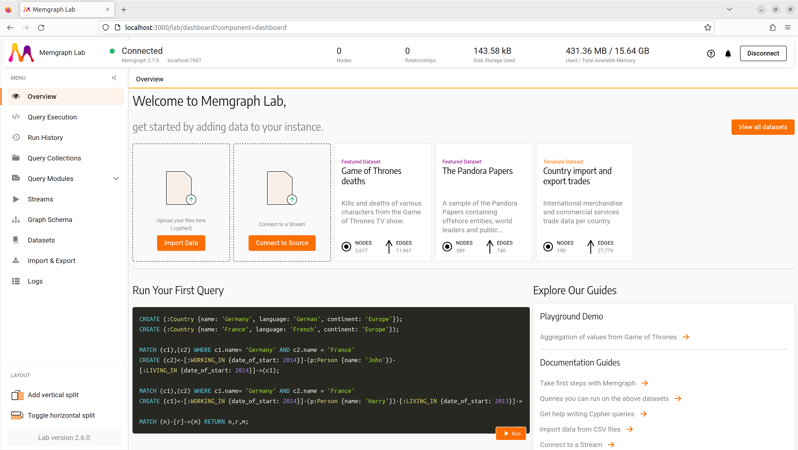
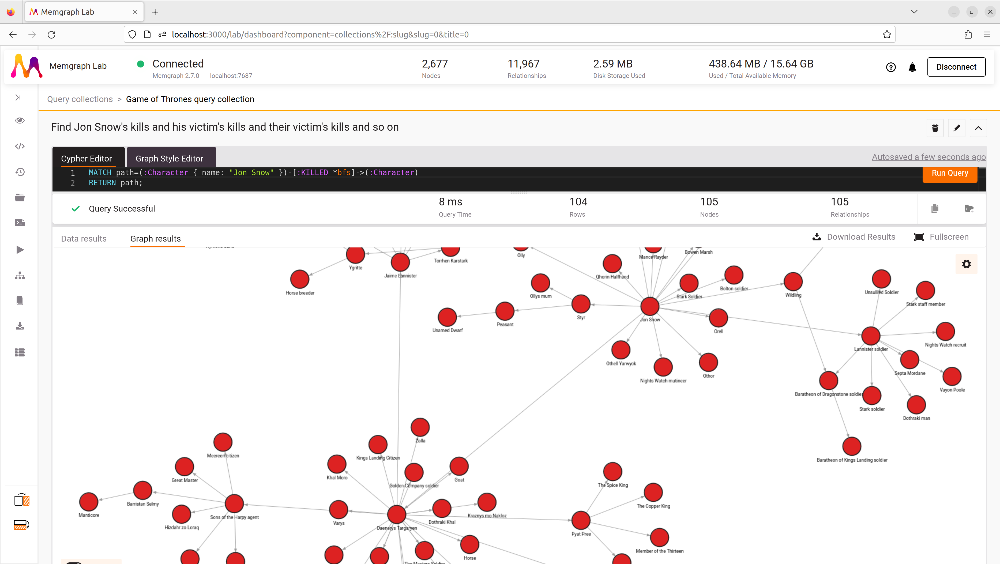

# Memgraph

- [memgraph](https://memgraph.com)
- [docs](https://memgraph.com/docs/)

## Install

### Docker

- docker hub: [memgraph/memgraph-platform](https://hub.docker.com/r/memgraph/memgraph-platform)
- [/memgraph/docker/docker-compose.yml](/memgraph/docker/docker-compose.yml)

```bash
cd memgraph/docker
docker compose up -d
docker compose down # -v
```

## Memgraph Lab

- docs: [Memgraph Lab](https://memgraph.com/docs/memgraph-lab)

Open: [http://localhost:3000/](http://localhost:3000/)



### Query

#### Find Jon Snow's kills and his victim's kills and their victim's kills and so on

```cypher
MATCH path=(:Character { name: "Jon Snow" })-[:KILLED *bfs]->(:Character)
RETURN path;
```


